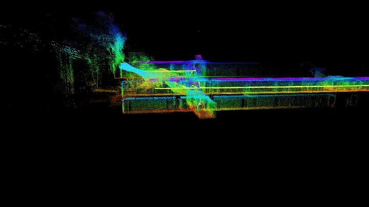
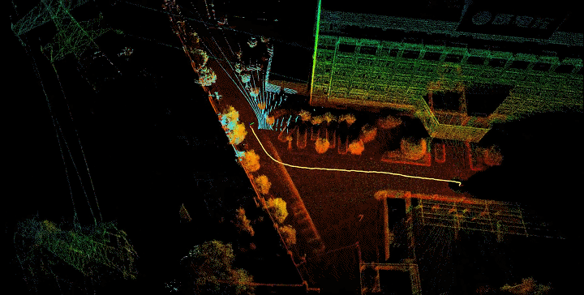
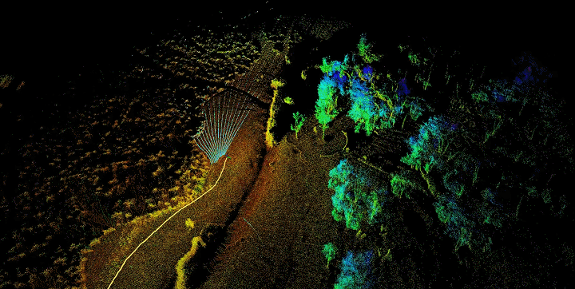
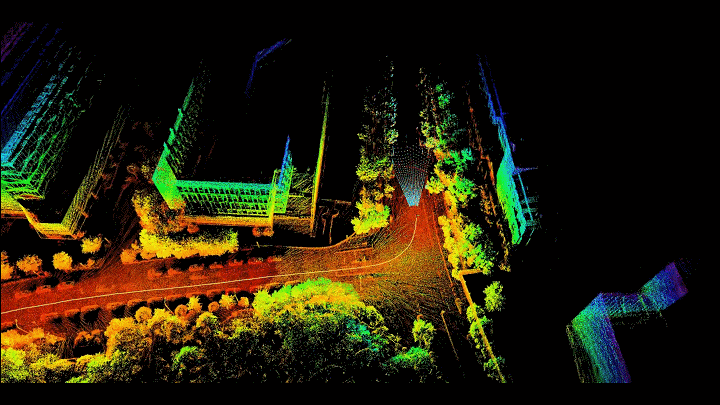
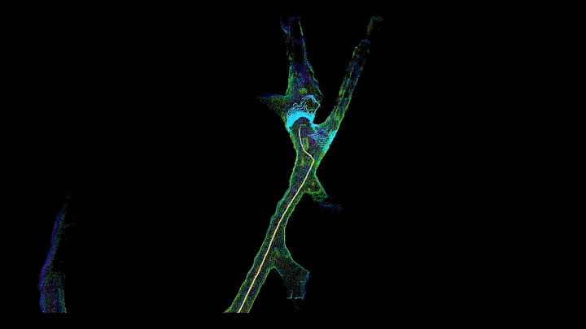

<div align="center">
  <h1>R³LIO: Robust Reflectivity-Assisted Rotating LiDAR-Inertial
  Odometry for Degenerate and Unstructured Environments</h1>
  <p><strong><i>ISPRS JPRS (2026, major revision)</i></strong></p>
  <br>

  <a href="https://github.com/zzywhu/R3LIO">
    
  </a>
  <!-- <a href="https://ieeexplore.ieee.org/abstract/document/11495237">
    
  </a>
  <a href="https://doi.org/10.1109/TIM.2026.3687975">
    
  </a> -->
</div>

<br>

Official implementation of **R³LIO**, a robust and accurate mobile mapping system built upon an iterative error-state Kalman filter (IESKF), targeting a low-cost rotating LiDAR setup (a 16-channel LiDAR actuated by a motor to continuously scan a full FoV).

## Quick Start

### Real Robot

Launch the real-robot pipeline with:

```bash
roslaunch rigelslam_rot run.launch
```

Test on self-recorded sequences:

<div align="center">
  <div style="display:inline-block; width:46%; margin:1% 1%; vertical-align:top; text-align:center;">
    <strong>Building</strong><br>
    
  </div>
  <div style="display:inline-block; width:46%; margin:1% 1%; vertical-align:top; text-align:center;">
    <strong>Park</strong><br>
    
  </div>
</div>

<div align="center">
  <div style="display:inline-block; width:46%; margin:1% 1%; vertical-align:top; text-align:center;">
    <strong>Parking Lot</strong><br>
    
  </div>
  <div style="display:inline-block; width:46%; margin:1% 1%; vertical-align:top; text-align:center;">
    <strong>Space</strong><br>
    
  </div>
</div>

<div align="center">
  <div style="display:inline-block; width:46%; margin:1% 1%; vertical-align:top; text-align:center;">
    <strong>Street</strong><br>
    
  </div>
  <div style="display:inline-block; width:46%; margin:1% 1%; vertical-align:top; text-align:center;">
    <strong>Tunnel</strong><br>
    
  </div>
</div>


### Simulation

1. Start the simulation environment:

```bash
roslaunch scout_gazebo test.launch
```

2. Start the simulated odometry:

```bash
roslaunch rigelslam_rot run_sim.launch
```


## Citation

If you find this project useful, please consider citing our paper:

<!-- ```bibtex
@ARTICLE{11495237,
  author={Zhou, Zhiyu and Gao, Zhi and Cao, Min and Wang, Jingshi and Li, Yong and Lin, Zhipeng and Yang, Wenbin and Wang, Xiaonan and Zhang, Qiyuan},
  journal={IEEE Transactions on Instrumentation and Measurement},
  title={EasyCalib: A Novel Target for High-Accuracy Fully Automatic Extrinsic Calibration of Camera and LiDAR},
  year={2026},
  volume={75},
  pages={9519815-9519815},
  keywords={Aerospace control;Antenna radiation patterns;Oscillators;Central Processing Unit;Pixel;Radio access networks;Regional area networks;Electronic mail;Digital images;Protocols;Calibration target;extrinsic calibration;light detection and ranging (LiDAR) and camera},
  doi={10.1109/TIM.2026.3687975}
}
``` -->

## Acknowledgments
Thank the authors of [FAST-LIO2](https://github.com/hku-mars/BEV_LIO) and [Scout Gazebo](https://github.com/ADDA-acx/scout_gazebo.git) for open-sourcing their outstanding works.
